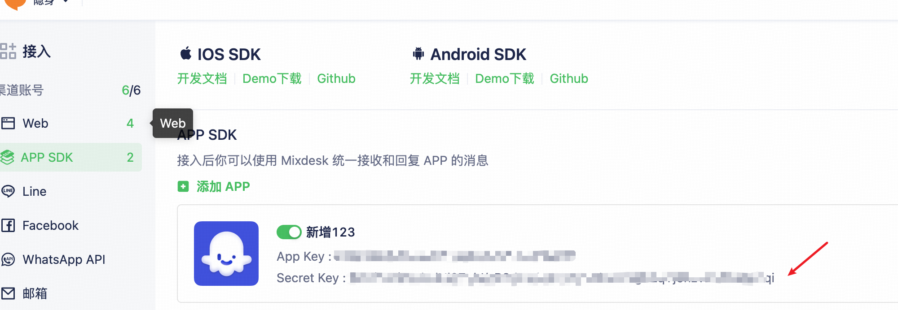

# MeiqiaSDK-Push-Signature-Example
Mixdesk SDK 推送的数据结构签名算法，多语言示例。


该项目是 `Mixdesk SDK` 推送的数据结构签名的算法。

开发者收到Mixdesk的推送数据后，开发者可以选择进行 `签名验证`。

我们使用的签名算法是 [HMAC-SHA1](https://en.wikipedia.org/wiki/Hash-based_message_authentication_code)，key 使用的是Mixdesk App 的 `Secret-Key`，请到工作台获取你的 `Secret-Key`。**Warning**，请不要将 `Secret-Key` 暴露给任何人。

下图是获取 `Secret-Key` 截图：


开发者收到Mixdesk的推送数据请求后，请获取头信息的 `Authorization`，其中是Mixdesk推送数据的签名。

我们提供 `Java、Python、Ruby、JavaScript、PHP、Golang` 五种语言的计算签名的代码，计算签名后，请和头信息的Mix desk数据签名进行比对，如果比对失败，则说明推送数据被修改过。

# 如何使用

### 数据样例

假如你填写的 URL 是 http://your.push.com/uri, 那么当有推送消息需要发送到你的服务器时，会有如下网络请求

```http
POST /uri HTTP/1.1
Host: your.push.com
Authorization: mixdesk_sign:OTE1NzA2ZmEyOGYyNDNjNDRlYWJjZDkyODYwZTU2MGRlYjI0ZjlkZQ==
Content-Type: application/json

{"clientId":"2xfSlIpNFjF3d1kRh2NJyCKkojE","content":"hello","contentType":"text","customizedData":{"avatar":"https://img.cdeledu.com/FAQ/2021/1108/6df81c168d904c65-0_chg.jpg","comment":"1373096861","contact_id":"2xfSlVoHwJ4OLwvsuv066bSBdDw","email":"","enterprise_id":1,"facebook_id":"","instagram_id":"","line_id":"","name":"rd_71041066","tags":null,"tel":"+8615725079823","telegram_id":"","track_id":""},"customizedId":"88899112233","deviceOS":"Android","deviceToken":"","fromName":"Super Administrator","id":11992715,"messageId":14048,"messageTime":"2025-06-04T03:41:24.976374","type":"message"}
```

### 比对

```json
{"clientId":"2xfSlIpNFjF3d1kRh2NJyCKkojE","content":"hello","contentType":"text","customizedData":{"avatar":"https://img.cdeledu.com/FAQ/2021/1108/6df81c168d904c65-0_chg.jpg","comment":"1373096861","contact_id":"2xfSlVoHwJ4OLwvsuv066bSBdDw","email":"","enterprise_id":1,"facebook_id":"","instagram_id":"","line_id":"","name":"rd_71041066","tags":null,"tel":"+8615725079823","telegram_id":"","track_id":""},"customizedId":"88899112233","deviceOS":"Android","deviceToken":"","fromName":"Super Administrator","id":11992715,"messageId":14048,"messageTime":"2025-06-04T03:41:24.976374","type":"message"}
```

如上数据，我们称之为 http-body。

sign 在网络请求的头部中的 `Authorization`

```http
mixdesk_sign:OTE1NzA2ZmEyOGYyNDNjNDRlYWJjZDkyODYwZTU2MGRlYjI0ZjlkZQ==
```

用 `Secret-Key` 对 http-body 进行  [HMAC-SHA1](https://en.wikipedia.org/wiki/Hash-based_message_authentication_code) 操作，然后就会得到 sign。

将两个 sign 进行比对，如果一样，就说明该请求合法，可以进行其他操作，如果不对，就舍弃。

### 自测

开发者的回调接口开发完成后，请先自己发送一条消息，测试一下回调接口是否能正确接收数据，如发送：

```
curl -X POST  -H "Accept: Application/json" -H "Content-Type: application/json" '你的回调 api 的地址' -d '{"content": "Hi, stranger!"}'
```

或发送 mock-message:

```
curl -X POST  -H "Accept: Application/json" -H "Content-Type: application/json" '你的回调 api 的地址' -d '{"clientId":"1jk23u3i434jkdjkf","content":"test","contentType":"text","customizedData":{"name":"#4","avatar":"https://app.meiqia.com/api/static/client-avatar/11-01.png"},"deviceOS":"Android","deviceToken":"d2433d6ad2861515e24316ddcbdg05eea23d","fromName":"Mixdesk","messageId":"111","messageTime":"2016-01-01T00:00:00.622580"}'
```

若开发者的回调接口能收到测试消息，但仍收不到Mixdesk的离线推送消息，请到 app.mixdesk.com 工作台找到要推送的那条对话，查看该顾客是否「已离线」，只有顾客「已离线」，Mixdesk的服务端才会推送离线消息给开发者的回调接口。

## 目录说明

```html
.
├── Golang       Golang 的 sign 代码及测试
├── Java         Java 的 sign 代码及测试
├── LICENSE      许可证
├── Node.js      Node.js 的 sign 代码及测试
├── PHP          PHP 的 sign 代码及测试
├── Python       Python 的 sign 代码及测试
├── README.md  
├── Ruby         Ruby 的 sign 代码及测试
└── sample.txt   确保 sign 正确的一些测试样例，与推送数据格式无关
```

